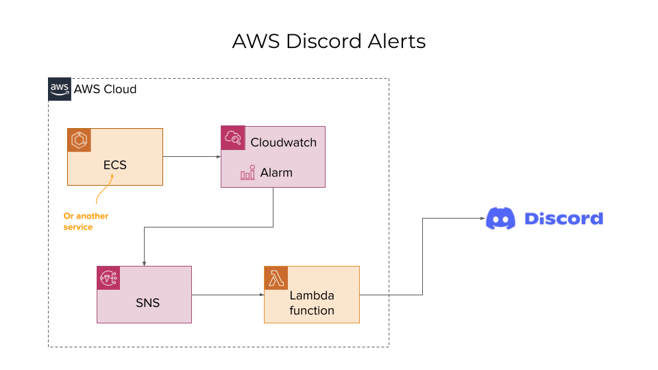

# Plio AWS Discord Alerts

This repository contains the Lambda function that ensures AWS alerts reaches to a Discord channel. You can configure all types of alerts that AWS Cloudwatch supports.

## Installation
To set up this project, visit the [installation steps](./docs/INSTALLATION.md).
